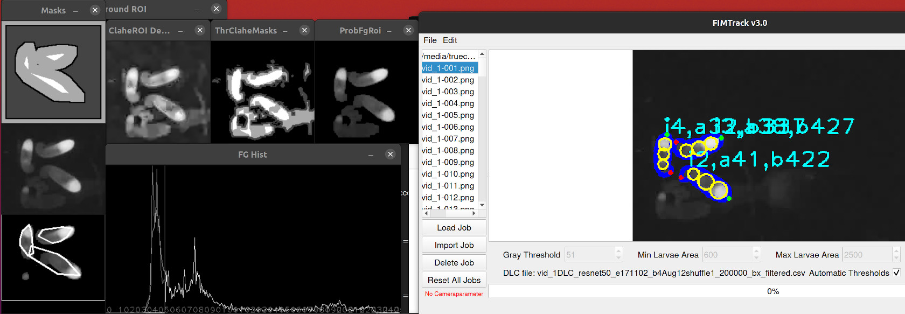

## What is this repository for?

FIMTrack is a larval tracking program to acquire locomotion trajectories
and conformation information of Drosophila melanogaster larvae. It is
optimized for FIM images. FIM is an acronym for FTIR-based Imaging Method,
whereby FTIR is the short form for Frustrated Total Internal Reflection.
Details can be found in

- B. Risse, S. Thomas, N. Otto, T. Löpmeier, D. Valkov, X. Jiang, and
  C. Klämbt, "FIM, a Novel FTIR-Based Imaging Method for High
  Throughput Locomotion Analysis," PLoS ONE, vol. 8, no. 1, p. e53963,
  Jan. 2013.

- Risse, B., Jiang, X., & Klämbt, C. (2013). FIM: Frustrated Total
  Internal Reflection Based Imaging for Biomedical Applications.
  ERCIM News, 95(Image Understanding), 11-12.

- B. Risse, N. Otto, D. Berh, X. Jiang, and C. Klämbt, "FIM Imaging
  and FIMTrack: Two New Tools Allowing High-throughput and Cost
  Effective Locomotion Analysis," Journal of Visualized Experiments:
  JoVE, no. 94, p. e52207, 2014.

- B. Risse, D. Berh, N. Otto, X. Jiang, and C. Klämbt, "Quantifying subtle
  locomotion phenotypes of Drosophila larvae using internal structures
  based on FIM images," Computers in Biology and Medicine, vol. 63,
  pp. 269-276, 2015.

For more informations contact fim[AT]uni-muenster[DOT]de

This FIMTrack fork extends the original version with some additional functionality like automatic adjusting of thresholds for each frame based on assisted data (e.g., [DeepLabCut](https://github.com/DeepLabCut/DeepLabCut) tacking, visual tracing and debugging of the thresholds inference, import of video in addition to image loading, output results extension.  
By Artem Lutov &lt;&#108;ua&#64;&#108;utan&#46;ch&gt;  
Affiliation: [UNIFR](https://www.unifr.ch), [Lutov Analytics](https://lutan.ch/)



## Known Forks

* An extension of the latest original FIMTrack aimed for fish tracking: https://github.com/wildner/FIMTrack_extension
* A refined version of an outdated FIMTrack: https://github.com/kostasl/FIMTrack

## Building FIMTrack

> To clone this repository with submodules use:
> ```
> $ git clone --recursive <repo_url>
> ```

It fetches [QCustomPlot](http://www.qcustomplot.com/) (ver. 1.3.2) submodule. To fetch submodules after the non-recursive clone, execute:
```
$ git submodule update --init --recursive
```

### Linux
These are instructions for Ubuntu/Debian systems, the packages should be similar on other distributions.

#### Dependencies
```
$ sudo apt-get install git libopencv-dev libhdf5-dev qt5-default g++ gengetopt
```

#### Build

Execute from the repository directory:
```
./GenerateArgparser.sh
qmake
make -j 4
```
> To build debug version: `make debug -j 4`

To execute the built app:
```
$ build/release/bin/FIMTrack
```
> To execute debug version: `build/debug/bin/FIMTrack`


### Mac OS X
Either use the same workflow as [Linux Build](####Build) or perform the build with Xcode and [Homebrew](http://brew.sh/).

#### Dependencies
* Git
    * `sudo brew install git`
* OpenCV
    * `sudo brew tap homebrew/science`
    * `sudo brew install opencv --c++11`
* Qt
    * `sudo brew tap homebrew/versions`
    * `sudo brew install qt5`
    * `sudo brew link --force qt5`
    
Ensure that OpenCV v4 is installed and its headers are located in `/usr/local/include/opencv4`:
```sh
$ sudo ln -s `find /usr/local -name "opencv4" -type d | grep "/include/"` /usr/local/include/opencv4
```
